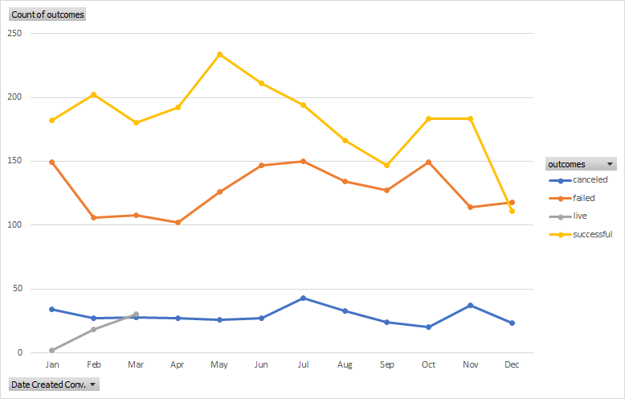

# An Analysis of Kickkstarter Campaigns
This is a multi level analysis on various Kickstarter campaign research projects

Based on this chart we have determined that a campaign started in June will be most effective
![Parent Category Outcomes Chart.png]
This Category based outcomes chart also indicates that theater projects have a relatively high level of success.
If taken into account with the 
